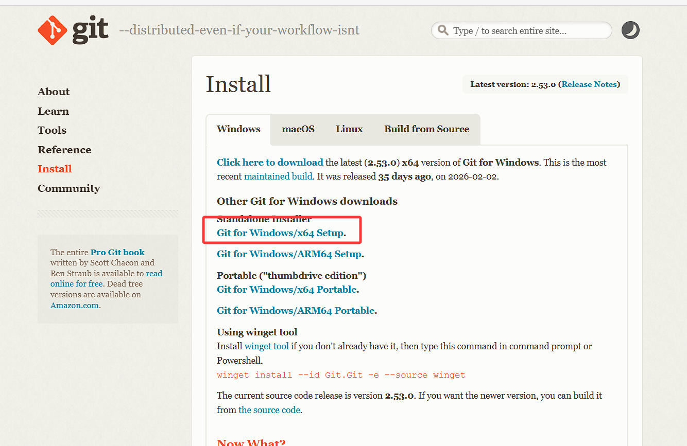
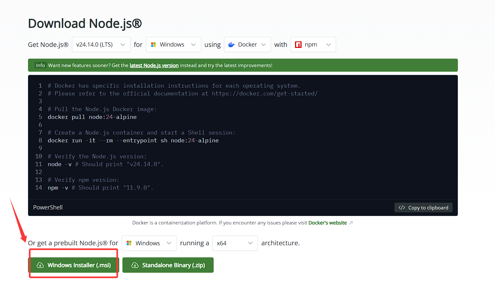
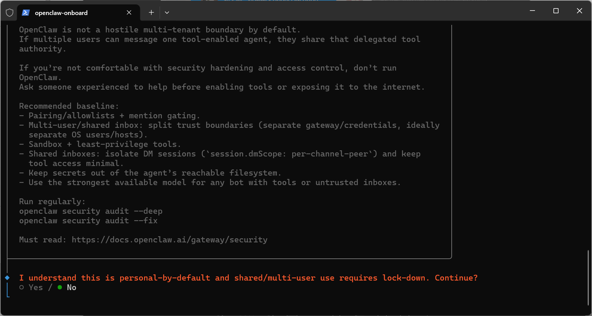
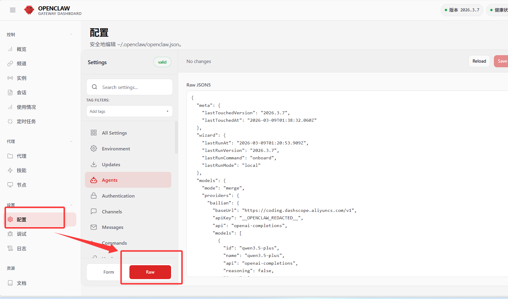
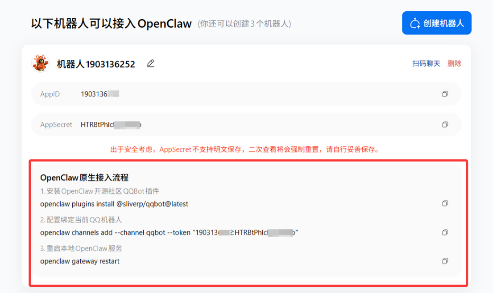

本文分为 openclaw 的安装、配置，以及 qq 机器人三块。

本文使用的 api 是阿里云百炼，其他服务商的配置方式应该也类似。

由于 ai 方面的文章时效性强，往往会有不小的变化，请注意文章成文时间。

## 安装
openclaw 依赖 git 和 nodejs，所以需要先安装这两样。

### 安装 git

访问网址：[https://git-scm.com/install/windows](https://git-scm.com/install/windows)

下载软件：


ps：如果下载很慢，可以右键复制链接到迅雷中下载，通常会快一点。

安装时一路下一步就好，可以修改应用的安装路径。

### 安装 nodejs

访问网址：[https://nodejs.org/en/download](https://nodejs.org/en/download)

下载软件：



同上，安装时一路下一步就好，可以修改应用的安装路径。

### 安装 openclaw
按 `Win+X` → 选择 **终端管理员**

首次运行需设置执行策略：

```powershell
Set-ExecutionPolicy RemoteSigned -Scope CurrentUser
```

输入 `Y` 确认

接下来执行安装脚本：

```powershell
iwr -useb https://openclaw.ai/install.ps1 | iex
```

需要一些时间安装，安装好后会弹出以下界面：



接下来进入配置阶段。

## 配置

安装结束后会自动出现提示信息，请根据提示信息完成 OpenClaw 初始化配置，参考配置如下：

| **配置项**                                                       | **配置内容**                           |
| ------------------------------------------------------------- | ---------------------------------- |
| I understand this is powerful and inherently risky. Continue? | 选择 ”Yes”                           |
| Onboarding mode                                               | 选择 “QuickStart”                    |
| Model/auth provider                                           | 选择 “Skip for now”，后续可以配置           |
| Filter models by provider                                     | 选择 “All providers”                 |
| Default model                                                 | keep current                       |
| Select channel (QuickStart)                                   | 选择 “Skip for now”，后续可以配置           |
| Configure skills now? (recommended)                           | 选择 “No”，后续可以配置。                    |
| Enable hooks?                                                 | 按空格键选中，选择“Skip for now”，按回车键进入下一步。 |
| How do you want to hatch your bot?                            | 选择 “Hatch in TUI”。                 |
ps：如果未出现，或者不小心退出了，可以运行 `openclaw onboard` 命令进行配置。

---

接着运行 `openclaw dashboard` 命令，复制出现的链接到浏览器中打开。

点击配置 → RAW



将以下 json 复制进去，需注意要把 API key 替换一下：

```json
{
  "models": {
    "mode": "merge",
    "providers": {
      "bailian": {
        "baseUrl": "https://coding.dashscope.aliyuncs.com/v1",
        "apiKey": "YOUR_API_KEY",
        "api": "openai-completions",
        "models": [
          {
            "id": "qwen3.5-plus",
            "name": "qwen3.5-plus",
            "reasoning": false,
            "input": ["text", "image"],
            "cost": { "input": 0, "output": 0, "cacheRead": 0, "cacheWrite": 0 },
            "contextWindow": 1000000,
            "maxTokens": 65536
          },
          {
            "id": "qwen3-max-2026-01-23",
            "name": "qwen3-max-2026-01-23",
            "reasoning": false,
            "input": ["text"],
            "cost": { "input": 0, "output": 0, "cacheRead": 0, "cacheWrite": 0 },
            "contextWindow": 262144,
            "maxTokens": 65536
          },
          {
            "id": "qwen3-coder-next",
            "name": "qwen3-coder-next",
            "reasoning": false,
            "input": ["text"],
            "cost": { "input": 0, "output": 0, "cacheRead": 0, "cacheWrite": 0 },
            "contextWindow": 262144,
            "maxTokens": 65536
          },
          {
            "id": "qwen3-coder-plus",
            "name": "qwen3-coder-plus",
            "reasoning": false,
            "input": ["text"],
            "cost": { "input": 0, "output": 0, "cacheRead": 0, "cacheWrite": 0 },
            "contextWindow": 1000000,
            "maxTokens": 65536
          },
          {
            "id": "MiniMax-M2.5",
            "name": "MiniMax-M2.5",
            "reasoning": false,
            "input": ["text"],
            "cost": { "input": 0, "output": 0, "cacheRead": 0, "cacheWrite": 0 },
            "contextWindow": 196608,
            "maxTokens": 32768
          },
          {
            "id": "glm-5",
            "name": "glm-5",
            "reasoning": false,
            "input": ["text"],
            "cost": { "input": 0, "output": 0, "cacheRead": 0, "cacheWrite": 0 },
            "contextWindow": 202752,
            "maxTokens": 16384
          },
          {
            "id": "glm-4.7",
            "name": "glm-4.7",
            "reasoning": false,
            "input": ["text"],
            "cost": { "input": 0, "output": 0, "cacheRead": 0, "cacheWrite": 0 },
            "contextWindow": 202752,
            "maxTokens": 16384
          },
          {
            "id": "kimi-k2.5",
            "name": "kimi-k2.5",
            "reasoning": false,
            "input": ["text", "image"],
            "cost": { "input": 0, "output": 0, "cacheRead": 0, "cacheWrite": 0 },
            "contextWindow": 262144,
            "maxTokens": 32768
          }
        ]
      }
    }
  },
  "agents": {
    "defaults": {
      "model": {
        "primary": "bailian/qwen3.5-plus"
      },
      "models": {
        "bailian/qwen3.5-plus": {},
        "bailian/qwen3-max-2026-01-23": {},
        "bailian/qwen3-coder-next": {},
        "bailian/qwen3-coder-plus": {},
        "bailian/MiniMax-M2.5": {},
        "bailian/glm-5": {},
        "bailian/glm-4.7": {},
        "bailian/kimi-k2.5": {}
      }
    }
  },
  "gateway": {
    "mode": "local"
  }
}
```

接着单击右上角 **Save** 保存，然后单击 **Update** 使配置生效。

更详细的参考阿里云百炼的文档：[大模型服务平台百炼控制台](https://bailian.console.aliyun.com/cn-beijing/?tab=doc#/doc/?type=model&url=3023085)

现在，你已经可以愉快的使用浏览器页面和龙虾聊天了。

## 接入 qq 机器人

访问： https://q.qq.com/qqbot/openclaw/login.html

扫码登录，点击创建机器人，然后运行它所提示的几行命令。ok，搞定了，就这么简单，腾讯这波是真给力。



