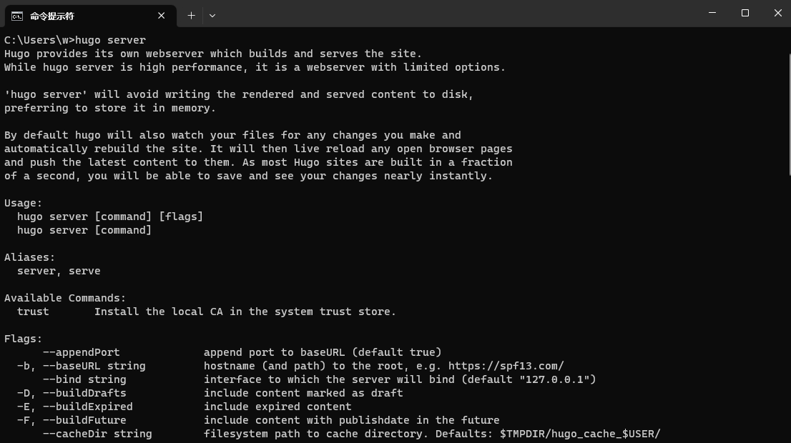

## Hugo
之前用的是 hexo ，最近发现了 hugo ，感觉还行，就拿来玩玩。 
跟 hexo 一样，都是生成静态页面的。

### 下载
去 github 上下载一下就完事了：[gohugoio/hugo: The world’s fastest framework for building websites. (github.com)](https://github.com/gohugoio/hugo)  
这里还有个小坑，这东西的 release 有两个版本，要下那个带 extended 的那个。

因为我是在 windows 平台，下载 windows-amd 64 的就可以了。

### 环境变量
需要把解压出来的 exe 文件放到 bin 文件夹下，然后加到环境变量里。

例如，我新建了一个 `D:\hugo\bin` 文件夹，然后把解压出来的 hugo. Exe 放到此文件夹。接着在系统环境变量 path 里，加入 `D:\hugo\bin` 。  
可以在 cmd 中输入 `hugo server` 看看是否添加好了



### 主题美化
[Complete List | Hugo Themes (gohugo.io)](https://themes.gohugo.io/)

去上面这个网站找了找，试了几个，发现有个叫 stack 的还不错，搜了搜发现了作者提供的一个模版：[CaiJimmy/hugo-theme-stack-starter](https://github.com/CaiJimmy/hugo-theme-stack-starter)  
作者还写好了 Github Actions ，只需要提交就好了，so sweet。

### Github page
Hugo 只负责生成静态页面，还需要把这些页面托管方便访问，github page 就是一个很好的选择。  
我之前用的是 hexo ，所以是建了一个 username. Github. Io 的库，然后往里面推就完事了。

而 stack-starter 这个项目是把静态页面推到了一个 gh-pages 的分支里。
所以需要更改 github page 的设置，位于 Settings -> pages 
然后更改 Branch


当然默认模版会有很多东西想要个性化，比如页底、外链。这些就去查文档后配置吧。
[Stack | Card-style Hugo theme designed for bloggers (jimmycai.com)](https://stack.jimmycai.com/)

### 忽略渲染
Hugo 可以配置忽略渲染某些文件  

使用 `hugo` 编译时，将忽略 `config.toml` 文件中指定的内容，比如：以 `.foo` 和 `.boo` 结尾的文件。
```toml
ignoreFiles = [ "\\.foo$", "\\.boo$" ]
```
上面使用了正则表达式，使用 `\` 转义是因为在 TOML 里。

[配置 Hugo - Hugo中文文档 (gohugo.org)](https://www.gohugo.org/doc/overview/configuration/)

## Obsidian
Obsidian 很好用，拿来写 md ，hugo 用来生成页面，强强联合，完美。  
但是用 obsidian 还有一些问题，好在插件生态很丰富。

###  插入图片重命名
Obsidian 原生插入图片时，有一些问题。

原生的插入图片，默认会是双链，而不是 md 格式的 `` 。需要在设置 -> 文件与链接 -> 关闭 使用 WiKi 链接。

还有原生的会自己生成一个文件名，例如 `Pasted image 20230726205233.png` 这个空格就很烦，hugo 不知道为什么不会渲染。所以需要一个更改文件名的插件，我使用了 paste-image-rename  
[reorx/obsidian-paste-image-rename](https://github.com/reorx/obsidian-paste-image-rename)

### 流程图
使用大家都用的 excalidraw ，然后导出图片到再插入到 md 中就行了。

不知道为什么 excalidraw 好像不会渲染，如果会渲染就在配置文件中忽略就好。


## Markdown
### 换行
obsidian 如果只回车一次，在页面上是不会渲染成换行的，这跟 md 的语法有关 [Markdown 换行语法](https://markdown.com.cn/basic-syntax/line-breaks.html)   
所以要么就回车两次，要么就在需要换行的段落后面加俩空格。